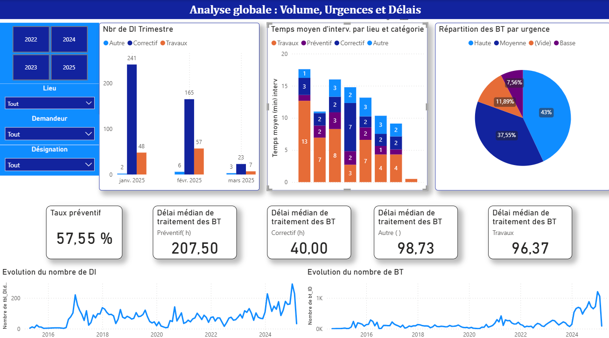
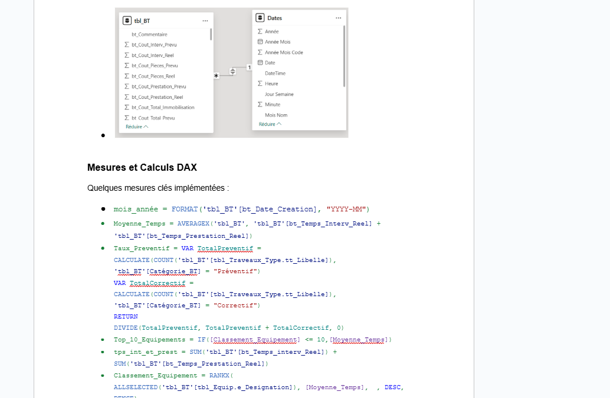
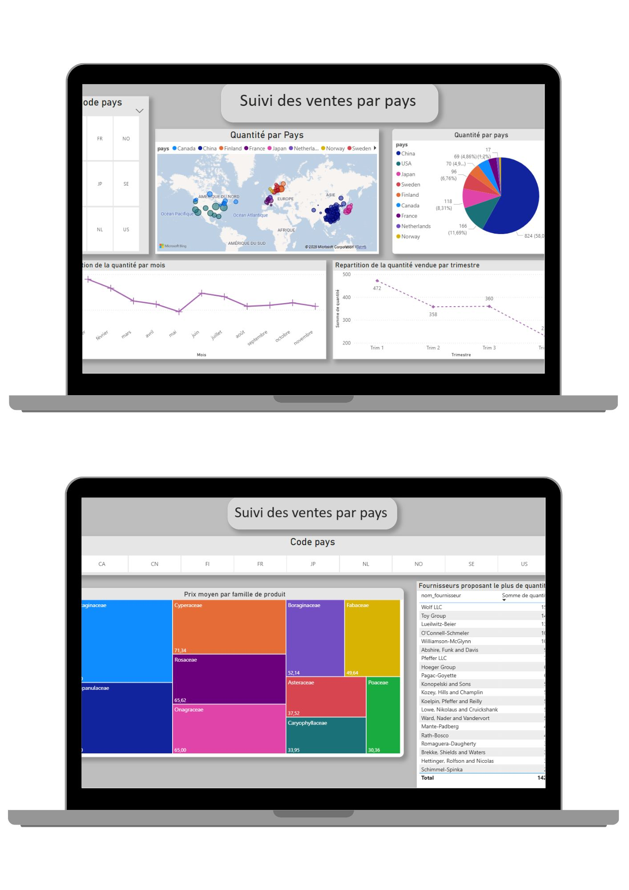

 

Animée par la curiosité pour les données et leur **potentiel** pour transformer les décisions, **j’accompagne les entreprises à valoriser leurs informations**.

J’effectue des **audits de données précis**, conçois des **dashboards interactifs** et automatise les flux pour fournir des **insights clairs et actionnables**, qui aident à la prise de décision et à l’amélioration des performances.
Chaque mission est pour moi l’occasion d’apprendre, de comprendre le métier de mes clients et de **créer des solutions sur-mesure, concrètes et impactantes**.

[Contactez-moi pour vos projets data](mailto:dolores.data.consulting@gmail.com)

## Stop au temps perdu !

Chaque mois, des heures sont gaspillées à **recopier des chiffres dans Excel** ou à **préparer manuellement des rapports**.  
👉 Ce temps pourrait être économisé grâce à l’**audit de vos données** et la mise en place de **dashboards automatisés**.

[Demander un audit de vos données (2–4 jours)](mailto:dolores.data.consulting@gmail.com?subject=Audit%20Data%202-4%20jours)

## Table des Matières
- [Ce que je peux vous apporter](#ce-que-je-peux-vous-apporter)
- [Compétences générales](#compétences-générales)
- [Compétences Techniques](#compétences-techniques)
- [Publications](#publications)
- [Projets](#projets)
    - [Audit de données et création d'un tableau de bords de suivi des interventions et travaux industrie](#audit-et-création-d-un-tableau-de-bords-de-suivi-des-interventions-et-travaux-secteurindustrie)
    - [Dashboard d’analyse des ventes internationales](#dashboard-danalyse-des-ventes-internationales)
    - [Analyse des accidents routiers en france des mineurs de -10 ans](#analyse-des-accidents-routiers-en-france-des-mineurs-de--10-ans)
    - [Dashboard d'analyse de ventes de forfaits téléphoniques](#dashboard-danalyse-de-ventes-de-forfaits-téléphoniques)
    - [Dashboard d'analyse de recouvrement de créances](#dashboard-danalyse-de-recouvrement-de-créances)
    - [Machine Learning Supervisé](#machine-learning-supervisé)
    - [Machine Learning Non Supervisé](#machine-learning-non-supervisé)

[English Version](./index_en.md)
--------------------------------------------------------------
## Ce que je peux vous apporter

✅**Audit de vos données et identification des points de friction**
✅**Visualisation et reporting clairs pour vos KPIs**
✅**Automatisation des flux de données pour gagner du temps**
✅**Analyse d’insights et recommandations concrètes**
✅**Méthodologie sur-mesure et approche centrée métier**

## Compétences générales

- Analyse de données et modélisation
- Visualisation & vulgarisation des insights
- Résolution de problèmes et esprit critique
- Méthodes agiles et travail collaboratif

## Compétences techniques

  

    <!-- Data Engineering -->
    

      
    

    

      
    

    

      
    

    

      
    

    

      
    

    

      
    

    <!-- Data Analysis -->
    

      
    

    

      
      
    

    

      
    

    

      
    

    

      
    

    

      
    

    <!-- Data Computing & Bases de Données -->
    

      
     
    

    

      
      
    

    

      
      
    

    

      
    

    

      
    

    

      
    

  

## Publications

**Medium :** [Data Science vs. Trading Algorithmique : Un Duel de Titans Technologiques](https://medium.com/@valide.dolores/data-science-vs-trading-algorithmique-un-duel-de-titans-technologiques-0d6acab938b6) 

**Medium :** [5 Structures de Données Essentielles pour les Data Scientists et Data Engineers](https://medium.com/@valide.dolores/5-structures-de-donn%C3%A9es-essentielles-pour-les-data-scientists-et-data-engineers-fae5509f4b84)
   
## Projets

### Audit et création d'un tableau de bords de suivi des interventions et travaux secteur Industrie
- **Contexte :** Détection des points de blocages dans la base de données. L'idée était de faciliter la communication entre les services de production et la direction. Gagner du temps lors des préparations de réunions de coordinations et mettre en évidence les défaillance dans la modélisation de données initiale.
- **Compétences :** Power BI Service, SQL , Power Query , DAX
- **Actions réalisées :**
   > - Audit de la base de données, avec rapport sur la qualité des données.
   > - Création d'un dashboard intéractif Power BI qui suit les travaux et interventions par équipes ou bâtiments.
- **Résultat :**
   > - Visualisation claire des goulots d'étranglement.
   > - Mise en avant des limites des logiciels utilisés et proposition de solutions concrètes scalables.
   > - Création d'une documentation détaillée. 

 | 

### Dashboard d’analyse des ventes internationales

- **Contexte :**  Ce projet utilise les données de Rainforest Global pour explorer et visualiser les ventes par pays et par fournisseur. L’objectif est de mettre en évidence les zones géographiques les plus performantes, d’identifier les fournisseurs stratégiques et de suivre l’évolution des ventes à l’échelle mondiale. Le rapport permet ainsi de comparer les performances commerciales entre marchés, d’optimiser les partenariats fournisseurs et d’orienter la stratégie de développement international.
- **Compétences :** Power BI, modélisation de données, visualisation avancée, storytelling avec la donnée.

### Analyse des accidents routiers en france des mineurs de -10 ans 

- **Description :** Ce projet à pour but de sensibiliser aux dangers de la route pour les plus jeunes. Je procède à une analyse exploratoire dans un premier temps puis je prédirais la gravité d'un accident selon plusieurs facteurs.
- **Compétences :** [EDA](#EDA), [python](#python), [régréssion supervisée](#régréssion-supervisée)
- **Lien vers le projet :** [Lien GitHub](https://github.com/DValide/Projet_perso_Accidents_routiers_de_mineurs_de_moins_de_10_ans)
- 
- 

### Dashboard d'analyse de ventes de forfaits téléphoniques
- **Description :** Ce projet explore les données de ventes de SmartFun Telecom Ltd,notemment les données de ventes de forfait téléphoniques, fournissant des insights clés grâce à des visualisations et des analyses statistiques. J'ai utilisé des techniques d'[EDA](#EDA) pour découvrir des tendances et des relations cachées dans les données.
- **Compétences :** Power BI

Ce rapport montre les ventes par région, produit, et période, permettant une vue d'ensemble des performances commerciales.

### Automatisation & Reporting de recouvrement de créances
- **Contexte :** Optimisation du suivi et reporting des créances clients. 
- **Compétences :** Power BI Service
-  **Actions réalisées :**
    > - Transformation et nettoyage des données de recouvrement
    > - Création d’un dashboard Power BI pour suivi des KPI et alertes
    > - Automatisation du reporting quotidien
- **Résultats :**
-  Temps de reporting divisé par 3, meilleure visibilité des actions prioritaires

  
### Machine Learning Supervisé
- **Description :** Dans ce projet, j'ai construit un modèle de régression pour prédire la consommation en énergie de bâtiments en utilisant. Le modèle a été évalué à l'aide de métriques comme [RMSE](#RMSE), [R²](R_2), [MAE](#MAE). Différents algorithmes ont été testés : [SVR](#SVR), [RandomForest](#RandomForest), [Elastic Net](#ElasticNet), [LGBM](#LGBM)
- **Compétences :** EDA, Scikit-learn, Feature Engineering, Tunning de paramètres, Validation croisée

- **Lien vers le projet :** [Lien GitHub](https://github.com/DValide/OC-DS-P4-Anticipez-les-besoins-en-consommation-de-batiments/tree/f1629b960ff2629a1dfc09eb2946cf1e948696bb)

### Machine Learning Non Supervisé
- **Description :** Ce projet implique le clustering de données clients e-commerce en groupes significatifs à l'aide de [K-means/DBSCAN/PCA](K-means/DBSCAN/PCA).
- **Compétences :** Scikit-learn, Clustering, PCA, RFM

- **Lien vers le projet :** [Lien GitHub](https://github.com/DValide/OC-DS-P5-Segmentez-des-clients-d-un-site-e-commerce/tree/main)

### Contact

  
  
  

