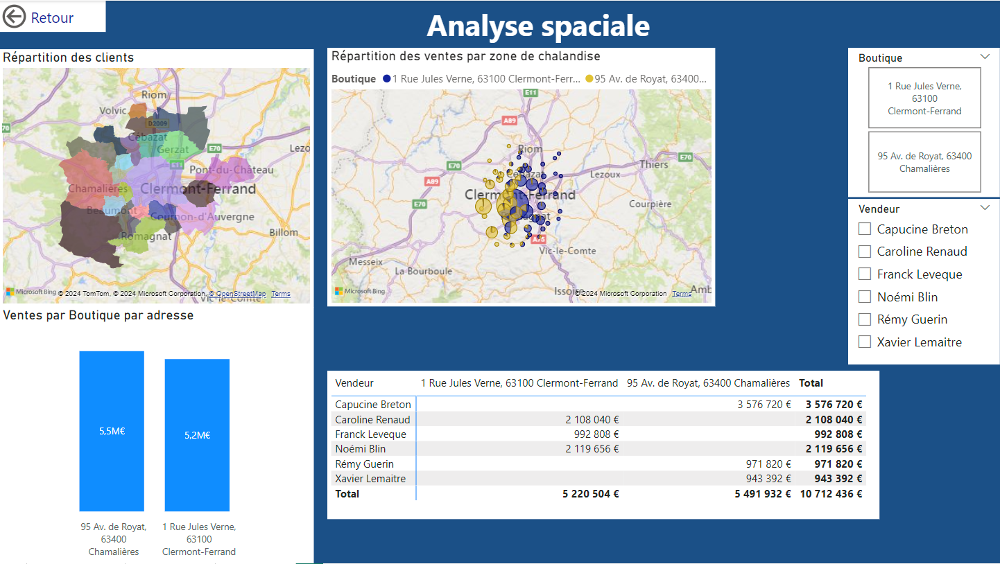

# [Dolores Valide] - Data Scientist | Data Analyst | Data enthusiastic

Bienvenue sur mon portfolio. Je suis une Data Scientist & Analyst passionné par l'exploration des données et le développement de modèles prédictifs.
Voici une sélection de mes projets qui démontrent mes compétences en data science, machine learning et visualisation de données.

## Table des Matières
- [À propos de moi](#à-propos-de-moi)
- [Compétences Techniques](#compétences-techniques)
    - [Langages de programmation](#langages-de-programmation)
    - [Machine-learning](#machine-learning)
    - [Analyse de données](#analyse-de-données)
    - [Base de données](#base-de-données)
    - [Data Engineering](#data-engineering)
    - [Data visualisation](#data-visualisation)
- [Compétences douces](#compétences-douces)
- [Projets](#projets)
    - [Projet 1 : Dashboard de business Intelligence (BI)](#projet-1--business-intelligence)
    - [Projet 2 : Machine Learning Supervisé](#projet-2--machine-learning-supervisé)
    - [Projet 3 : Machine Learning Non Supervisé](#projet-3--machine-learning-non-supervisé)
    - [Projet 4 : Séries Temporelles](#projet-4--séries-temporelles)
    - [Projet 5 : Projet Avancé (Deep Learning/NLP)](#projet-5--projet-avancé-deep-learningnlp)
- [Compétences](#compétences)
- [Contact](#contact)

## Comptétences techniques
### Langages de programmation 
- **Python** 
- **SQL** 

### Machine-Learning
- **Scikit-Learn** 
- **TensorFlow** 

### Analyse de données 
- **Pandas** 
- **NumPy** 
- **Matplotlib** 
- **Seaborn** 

### Base de données
- **MySQL** 
- **PostgreSQL** 

### Data Engineering  
- **Hadoop** 
- **Pyspark** 
- **Docker** 
- **Git** 
- **AWS** 

### Data visualisation
- **Kibana** 
- **Power BI** 
- **Excel** 

## Comptétences douces
 - Nettoyage de données
 - Feature engineering
 - Modélisation prédictive
 - Agile
 - Apprentissage automatique 
 - Visualisation de données  
 - Vulgarisation

### Formation
- **[Diplôme]** - [Université], [Année]
- **Certifications** : [Certification 1], [Certification 2]

### Expérience Professionnelle
- **[Poste actuel ou précédent]** - [Entreprise], [Période]
- **Responsabilités clés :**
    - [Responsabilité 1]
    - [Responsabilité 2]
   
## Projets

### Projet 1 : Business Intelligence (BI)
- **Description :** Ce projet explore les données de ventes de SmartFun Telecom Ltd,notemment les données de ventes de forfait téléphoniques, fournissant des insights clés grâce à des visualisations et des analyses statistiques. J'ai utilisé des techniques d'EDA pour découvrir des tendances et des relations cachées dans les données.
- **Compétences :** Power BI
- 
- 
- 
- 
Ce rapport montre les ventes par région, produit, et période, permettant une vue d'ensemble des performances commerciales.
- **Lien vers le projet :** [Lien GitHub ou Notebook]

### Projet 2 : Machine Learning Supervisé
- **Description :** Dans ce projet, j'ai construit un modèle de [régression/classification] pour prédire [cible] en utilisant [Dataset]. Le modèle a été évalué à l'aide de métriques comme [métrique 1], [métrique 2].
- **Compétences :** Scikit-learn, Feature Engineering, Validation Croisée
- **Lien vers le projet :** [Lien GitHub ou Notebook]

### Projet 3 : Machine Learning Non Supervisé
- **Description :** Ce projet implique le clustering de [données] en groupes significatifs à l'aide de [K-means/DBSCAN/PCA]. L'analyse a permis d'identifier [insight principal].
- **Compétences :** Scikit-learn, Clustering, PCA
- **Lien vers le projet :** [Lien GitHub ou Notebook]

### Projet 4 : Séries Temporelles
- **Description :** Pour ce projet, j'ai développé un modèle de prévision basé sur des séries temporelles pour [données temporelles]. Le modèle ARIMA/SARIMA a été utilisé pour prédire [cible] avec une précision de [précision].
- **Compétences :** Python, Statsmodels, Séries Temporelles, ARIMA
- **Lien vers le projet :** [Lien GitHub ou Notebook]

### Projet 5 : Projet Avancé (Deep Learning/NLP)
- **Description :** J'ai construit un modèle [CNN/RNN] pour [tâche spécifique], en utilisant [Dataset]. Ce projet montre mes compétences en deep learning et traitement du langage naturel.
- **Compétences :** TensorFlow/PyTorch, NLP, Deep Learning
- **Lien vers le projet :** [Lien GitHub ou Notebook]

## Contact

Je suis toujours ouvert à de nouvelles opportunités et collaborations. N'hésitez pas à me contacter via les plateformes suivantes :

- **Email :** [valide.dolores@gmail.com]
- **LinkedIn :** [www.linkedin.com/in/d-valide]
- **GitHub :** [https://github.com/DValide]
### Expériences 
## Projet personnel  - 2024

