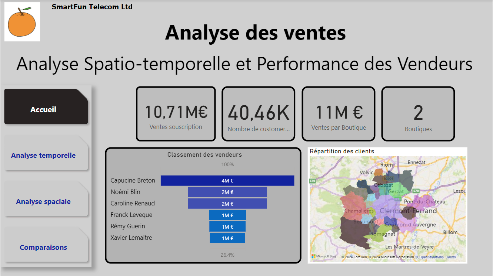

# Dolores Valide - Data Scientist | Data Analyst | Consultante

 La data est la valeur montante de cette décennie, et si je vous aidais à valoriser la votre ?! \
 \
  Bonjour, je suis Dolores Valide, data scientist capable de travailler sur vos projets de data science, data analyse et business intelligence.\
  Ici vous trouverez mon parcours et mes projets, je vous dévoile ma passion pour la data.

  **Je suis toujours ouverte à de nouvelles opportunités et collaborations. N'hésitez pas à me contacter via les plateformes suivantes :**

  
  
  
  

## Table des Matières
- [Ce que je peux vous apporter](#ce-que-je-peux-vous-apporter)
- [Compétences Techniques](#compétences-techniques)
- [Compétences générales](#compétences-générales)
- [Publications](#publications)
- [Projets](#projets)
    - [Analyse des accidents routiers en france des mineurs de -10 ans](#analyse-des-accidents-routiers-en-france-des-mineurs-de--10-ans)
    - [Dashboard d'analyse de ventes de forfaits téléphoniques](#dashboard-danalyse-de-ventes-de-forfaits-téléphoniques)
    - [Dashboard d'analyse de recouvrement de créances](#dashboard-danalyse-de-recouvrement-de-créances)
    - [Machine Learning Supervisé](#machine-learning-supervisé)
    - [Machine Learning Non Supervisé](#machine-learning-non-supervisé)
    - [Séries Temporelles](#séries-temporelles)
    - [Projet Avancé (Deep Learning/NLP)](#projet--projet-avancé-deep-learningnlp)

[English Version](./index_en.md)
--------------------------------------------------------------
## Ce que je peux vous apporter

✅**Détection d'Insights**
✅**Aide à la décision**
✅**Analyse de tendances**
✅**Résolution de problèmes**
✅**Esprit critique**
✅**Amélioration continue**

## Compétences Techniques

| **Data Engineering**  | **Data Analysis**  | **Data Computing & Bases de Données**  |
|-----------------------|--------------------|----------------------------------------|
|  |  |  |
|  |  | |
|  | |  |
|  |  |  |
|  |  | |
|  |  | |
|  |  | |

## Compétences générales

 - Modélisation de données
 - Nettoyage de données
 - Feature engineering
 - Modélisation prédictive
 - Apprentissage automatique 
 - Visualisation de données  
 - Vulgarisation
 - Agile

## Publications

**Medium :** [Data Science vs. Trading Algorithmique : Un Duel de Titans Technologiques](https://medium.com/@valide.dolores/data-science-vs-trading-algorithmique-un-duel-de-titans-technologiques-0d6acab938b6) 

**Medium :** [5 Structures de Données Essentielles pour les Data Scientists et Data Engineers](https://medium.com/@valide.dolores/5-structures-de-donn%C3%A9es-essentielles-pour-les-data-scientists-et-data-engineers-fae5509f4b84)
   
## Projets

### Analyse des accidents routiers en france des mineurs de -10 ans 
- **Description :** Ce projet à pour but de  sensibiliser aux dangers de la route pour les plus jeunes. Je procède à une analyse exploratoire dans un premier temps puis je prédirais la gravité d'un accident selon plusieurs facteurs.
- **Compétences :** [EDA](#EDA), [python](#python), [régréssion supervisée](#régréssion-supervisée)
- **Lien vers le projet :** [Lien GitHub](https://github.com/DValide/Projet_perso_Accidents_routiers_de_mineurs_de_moins_de_10_ans)
- 
  

### Dashboard d'analyse de ventes de forfaits téléphoniques
- **Description :** Ce projet explore les données de ventes de SmartFun Telecom Ltd,notemment les données de ventes de forfait téléphoniques, fournissant des insights clés grâce à des visualisations et des analyses statistiques. J'ai utilisé des techniques d'[EDA](#EDA) pour découvrir des tendances et des relations cachées dans les données.
- **Compétences :** Power BI
 
 
 
 
Ce rapport montre les ventes par région, produit, et période, permettant une vue d'ensemble des performances commerciales.

### Dashboard d'analyse de recouvrement de créances
- **Description :** Ce projet explore les données de recouvrement de créances, fournissant les KPI clés grâce à des visualisations et des analyses statistiques. 
- **Compétences :** Power BI

  
### Machine Learning Supervisé
- **Description :** Dans ce projet, j'ai construit un modèle de régression pour prédire la consommation en énergie de bâtiments en utilisant. Le modèle a été évalué à l'aide de métriques comme [RMSE](#RMSE), [R²](R_2), [MAE](#MAE). Différents algorithmes ont été testés : [SVR](#SVR), [RandomForest](#RandomForest), [Elastic Net](#ElasticNet), [LGBM](#LGBM)
- **Compétences :** EDA, Scikit-learn, Feature Engineering, Tunning de paramètres, Validation croisée

- **Lien vers le projet :** [Lien GitHub](https://github.com/DValide/OC-DS-P4-Anticipez-les-besoins-en-consommation-de-batiments/tree/f1629b960ff2629a1dfc09eb2946cf1e948696bb)

### Machine Learning Non Supervisé
- **Description :** Ce projet implique le clustering de données clients e-commerce en groupes significatifs à l'aide de [K-means/DBSCAN/PCA](K-means/DBSCAN/PCA).
- **Compétences :** Scikit-learn, Clustering, PCA, RFM

- **Lien vers le projet :** [Lien GitHub](https://github.com/DValide/OC-DS-P5-Segmentez-des-clients-d-un-site-e-commerce/tree/main)

